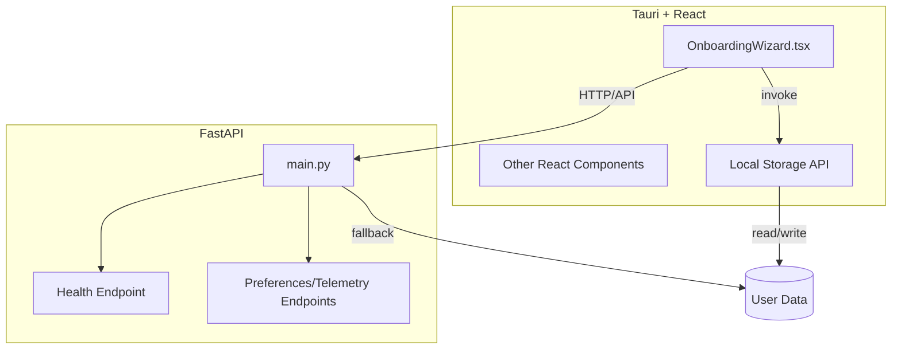

# Next Steps Execution Plan

## 1. Review Summary

- **PRD**: Clear goals—privacy-first, zero-CLI, cross-platform, local-only data. Features and non-goals are well defined.
- **Plan**: NEXT_STEPS_PLAN.md is up to date and identifies current state, gaps, and next steps.
- **Frontend (OnboardingWizard.tsx)**:
  - Steps 0–5 UI is fully implemented with a modern design system featuring step indicators, custom form elements, dark/light mode support, and enhanced visual feedback.
  - All steps now have complete logic with local storage integration.
  - System Compatibility Check screen enhanced with status indicators (good, warning, critical) and gradient progress bars.
- **Backend (main.py)**:
  - API includes `/health`, `/preferences` (GET/POST), `/onboarding` (POST), and `/telemetry` (POST) endpoints.
  - Application can now function without the backend server by using Tauri's local storage capabilities.
- **Local Storage**:
  - Implemented Tauri commands for preferences management: `get_preferences`, `save_preferences`, `save_onboarding_data`, and `store_telemetry_event`.
  - Updated API service to use these commands instead of HTTP requests.
- **Testing**: Unit tests pass for frontend (all steps) and backend (`/health`). Tests for new UI steps have been updated to properly mock Tauri invoke commands. E2E tests cover basic flow but need expansion.
- **Packaging/Distribution**: Build automation scripts created (see `/scripts`). Testing and CI integration still needed. CSP port mismatch resolved.
- **Docs**: PRD and rules are up to date; feature-specific docs may be missing.

---

## 2. Proposed Next Steps

### A. Product/Feature Development (Highest Priority)
- **Expand Application Features**
  - Implement additional features based on user feedback.
  - Consider adding cloud synchronization as an optional feature.

### B. Testing & QA (High Priority)
- **Add Backend Tests**
  - Cover new API endpoints (`/preferences`, `/onboarding`, `/telemetry`), including error cases.
- **Add Frontend Tests**
  - Add tests for local storage integration.
- **Expand E2E Tests**
  - Cover full onboarding flow, including new features and backend interaction.
- **Add Integration Tests**
  - Test frontend-backend integration specifically.

### C. Documentation (Medium Priority)
- **Update PRD**
  - Fill in open questions (update/patching strategy) and log changes.
- **Add Feature Docs**
  - Document onboarding flow, backend API, packaging process, and local storage mechanism.

### D. Code Quality (Medium Priority)
- **Refactor Logic**
  - Refactor repeated logic (e.g., preferences handling) for maintainability.
- **State Management**
  - Improve state management if onboarding grows in complexity.

### E. Packaging & Distribution (Lower Priority)
- **Automate Build**
  - Test cross-platform packaging.
  - Integrate build/test automation into CI.

### F. Privacy & Security (Ongoing)
- **Data Handling**
  - Ensure all user data is stored locally and document the storage mechanism.
- **Security**
  - Review and document local storage and privacy guarantees.

---

## 3. Architecture Diagram

---

**Update this document as features, requirements, or architecture evolve.**
