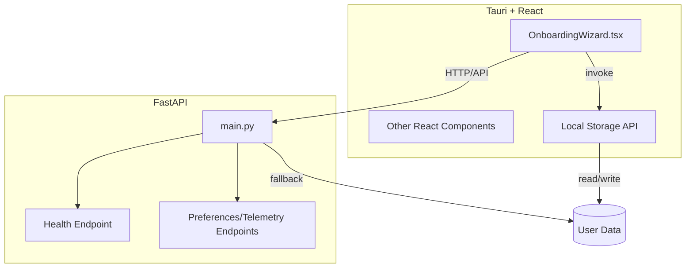

# Next Steps Plan

## 1. Current State

- **PRD**: Clear on privacy, zero-CLI, cross-platform, and local-only data. Features and non-goals are well defined. Some open questions remain (future features, privacy guarantees, update/patching).
- **Frontend**: React + Tauri onboarding wizard UI is fully implemented (steps 0-5) with a modern design system. Features include step indicators, custom form elements, dark/light mode support, and enhanced visual feedback. Uses Tailwind for styling with custom components. Unit tests pass but need expansion for new steps.
- **Backend**: FastAPI API includes `/health`, `/preferences` (GET/POST), `/onboarding` (POST), and `/telemetry` (POST) endpoints. Unit tests pass for `/health` but need expansion for new endpoints.
- **Local Storage**: Implemented Tauri's native capabilities for storing preferences and telemetry data locally, eliminating dependency on the backend server for basic functionality.
- **System Compatibility Check**: Enhanced with status indicators (good, warning, critical) and gradient progress bars that change color based on status.
- **Testing**: Both unit and E2E tests exist and now pass.
- **Dependency Management**: Documented and up to date.
- **Project Rules**: Enforced via linting, type safety, and test requirements.

---

## 2. Gaps and Open Questions

- **PRD Open Questions**:
  - What additional features are planned for future releases?
  - ~~What are the specific privacy guarantees and threat models?~~ (Addressed in PRD)
  - How will updates and patching be handled?
- **Onboarding Wizard**:
  - ~~UI is complete with modern design, but logic for persisting/retrieving preferences and submitting telemetry is missing.~~ (Implemented using Tauri's local storage capabilities)
  - ~~Preferences are only posted at the end; no retrieval of saved preferences on wizard start.~~ (Implemented with local storage for immediate feedback)
- **Backend**:
  - API endpoints exist but lack comprehensive testing.
  - Endpoints lack robust error handling and validation (e.g., file I/O errors, invalid data).
- **Packaging/Distribution**:
  - Build automation scripts created (see `/scripts`). Testing and CI integration still needed.
  - ~~Tauri CSP allows only port 5000, but backend runs on 5002 (port mismatch).~~ (Resolved: CSP allows 5002)
- **Documentation**:
  - PRD and rules are up to date, but feature-specific docs may be missing.
  - ~~Local storage mechanism and privacy guarantees need to be documented.~~ (Documented in PRD)
- **Testing**:
  - Backend, frontend, and E2E tests need expansion for new features and integration flows.
- **Code Quality**:
  - Repeated logic (e.g., preferences handling) could be refactored for maintainability.
  - State management may need improvement if onboarding grows in complexity.

---

## 3. Suggested Next Steps

### A. Product/Feature Development (Highest Priority)
- ~~**Integrate Frontend and Backend**:~~ (Completed with local storage implementation)
  - ~~Connect onboarding wizard to backend endpoints for data persistence and retrieval.~~ (Implemented using Tauri's native capabilities)
  - ~~Retrieve saved preferences on wizard start to pre-fill state.~~ (Implemented)
  - ~~Save preferences and telemetry earlier in the flow for a smoother UX.~~ (Implemented with debounced saving)
- **Expand Application Features**:
  - Implement additional features based on user feedback.
  - Consider adding cloud synchronization as an optional feature.

### B. Testing & QA (High Priority)
- **Add Backend Tests**: Cover new API endpoints (`/preferences`, `/onboarding`, `/telemetry`), including error cases.
- **Add Frontend Tests**: Cover new onboarding steps (Preferences, Completion) and integration flows.
- **Expand E2E Tests**: Cover full onboarding flow, including new features and backend interaction.
- **Add Integration Tests**: Test frontend-backend integration specifically.

### C. Documentation (Medium Priority)
- **Update PRD**: ~~Fill in open questions (privacy guarantees, update/patching strategy) and log changes.~~ (Privacy guarantees addressed; update/patching strategy still needed)
- **Add Feature Docs**: Document onboarding flow, backend API, packaging process, and local storage mechanism.

### D. Code Quality (Medium Priority)
- **Refactor Logic**: Refactor repeated logic (e.g., preferences handling) for maintainability.
- **State Management**: Improve state management if onboarding grows in complexity.

### E. Packaging & Distribution (Lower Priority)
- **Automate Build**: ~~Add scripts for Tauri and PyInstaller builds.~~ (Done) Test cross-platform packaging. Integrate build/test automation into CI.

### F. Privacy & Security (Ongoing)
- **Define Privacy Guarantees**: ~~Update PRD with explicit privacy guarantees and threat models.~~ (Done)
- **Data Handling**: ~~Ensure all user data is stored locally and document the storage mechanism.~~ (Implemented and documented)
- **Security**: ~~Update Tauri CSP to match backend port (5002).~~ (Resolved) ~~Review and document local storage and privacy guarantees.~~ (Completed)

---

## 4. Architecture Overview

---

**Update this document as features, requirements, or architecture evolve.**
